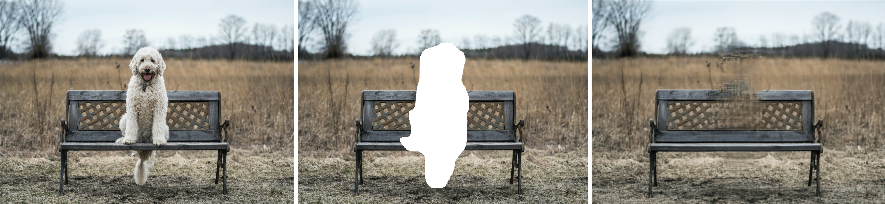

# Deep_image_prior_inpainting

Implementation of the Deep Image Prior paper for a school project for inpainting with Edge Connect GAN for comparison

# Description

The goal of the project is to do image inpainting. Popular approaches use Generative models (GAN, Diffusion models) trained on large dataset to infer the missing parts. The Deep Image Prior study proposes a method to do so without training a model on a large dataset, but using CNNs as a prior to retrieve the masked part of the image.

<p align="center">
  
  <br />
  <em>Original Image / Masked Image / Image generated using Deep Image Prior</em>
</p>

# Data

To add more images, you can add an image file in the data folder, you will also have to add a mask corresponding to that image. The mask should be a binary image (with only one channel), therefore it is preferable to use jpg images.

# Reproducibility

To reproduce the results, you have to create the conda environment :

```
conda env create -f environments.yml
```

You can then use the jupyter notebook associated : DeepImagePrior. It is possible to run it on collab using the first two lines.

Inside you will be able to chose which image you want to inpaint and which particular model. The available models are EncoderDecoder, EncoderDecoderSkipConnections and EncoderDecoderResidualConnections.

The image will then be transformed into a numpy array and cropped, using functions in the utils folder (that have been taken from the official Deep Image Prior implementation). Then the model chosen will be trained using Adam, a noisy input, and a MSE loss. This loss will compare the generated image with a mask and the image chose with a mask, the goal being that the 2 images should be the same on the areas exterior to the mask.

In a second time, one can use the EdgeConnect GAN by just changing the images at the beginning of this section.

# About the code

The models aforementionned are implemented using classes that can be found inside the models folders. The file Blocks.py contain the blocks that are going to be used in the Encoder Decoder models. There is :

- A block to do down sampling (DownSamplerBlock) composed of two convolutional layer using batch normalization and leaky ReLU. The first convolutional layer divides by 2 the size of the image (with a stride equals to 2), the second will conserve the same shape because of a well chosen padding.
- A block to do up sampling (UpSamplerBlock) also composed of two convolutional layer using batch normalization and leaky ReLU. Both layers this time conserves the shape of the images since the upsampling is done at the very end, effectively multiplying the shape by 2.
- A block to do skip connections which is just composed of a convolutional layer also using batch normalization and leaky ReLU

The EncoderDecoder model makes use of the down sampling blocks in the Encoder part and the up sampling blocks in the Decoder part. There is a last convolutional layer at the end to resize the generated image to get the same shape as the original image.

The EncoderDecoderSkipConnections model has the same architecture however we do retain the data before each down sampling blocks to also send it in the skip connection blocks. These will be connected to the input of the opposite up sampling blocks, which also means we have to take care of the number of input in the up sampling blocks since we are going to concatenate the data alongside the channels. Mathematically, if $N$ is the number of blocks and $(D_i)__{i=1}^{N}, (U_i)__{i=1}^{N}, (S_i)_{i=1}^{N}$ the down sampling blocks, up sampling blocks and skip blocks. Then,

$$ \text{Number of channels inputs}(U_i) = \text{Number of channels output}(U_{i-1}) + \text{Number of channels output}(S_{N+1-i}) $$

This is true for $i \in [1, N]$, if we define $U_0 = D_N$.

The EncoderDecoderResidualConnections model does not use the skip connection blocks, as the results of the down sampling block will directly be added to the results of the up sampling blocks. It is necessary to postpone the upsampling part after the addition has been done otherwise the shapes do not match.

The EdgeModelInpainting is a GAN model directly taken from the EdgeConnect paper alongside the weights in order to compare our results.

# Official implementation

https://github.com/DmitryUlyanov/deep-image-prior

# Citation

```
@article{UlyanovVL17,
    author    = {Ulyanov, Dmitry and Vedaldi, Andrea and Lempitsky, Victor},
    title     = {Deep Image Prior},
    journal   = {arXiv:1711.10925},
    year      = {2017}
}
```

```
@inproceedings{nazeri2019edgeconnect,
  title={EdgeConnect: Generative Image Inpainting with Adversarial Edge Learning},
  author={Nazeri, Kamyar and Ng, Eric and Joseph, Tony and Qureshi, Faisal and Ebrahimi, Mehran},
  journal={arXiv preprint},
  year={2019},
}
```

```
@InProceedings{Nazeri_2019_ICCV,
  title = {EdgeConnect: Structure Guided Image Inpainting using Edge Prediction},
  author = {Nazeri, Kamyar and Ng, Eric and Joseph, Tony and Qureshi, Faisal and Ebrahimi, Mehran},
  booktitle = {The IEEE International Conference on Computer Vision (ICCV) Workshops},
  month = {Oct},
  year = {2019}
}
```